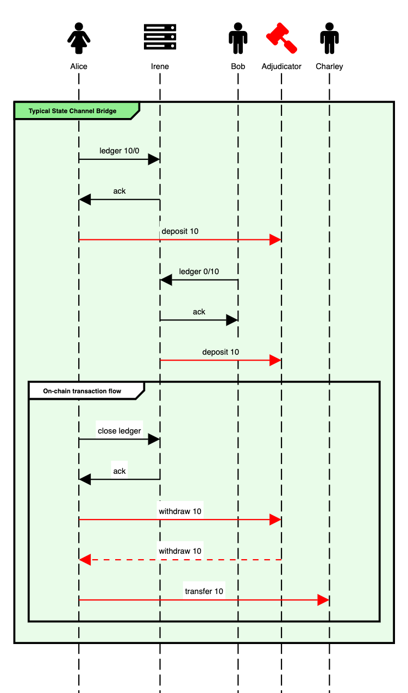
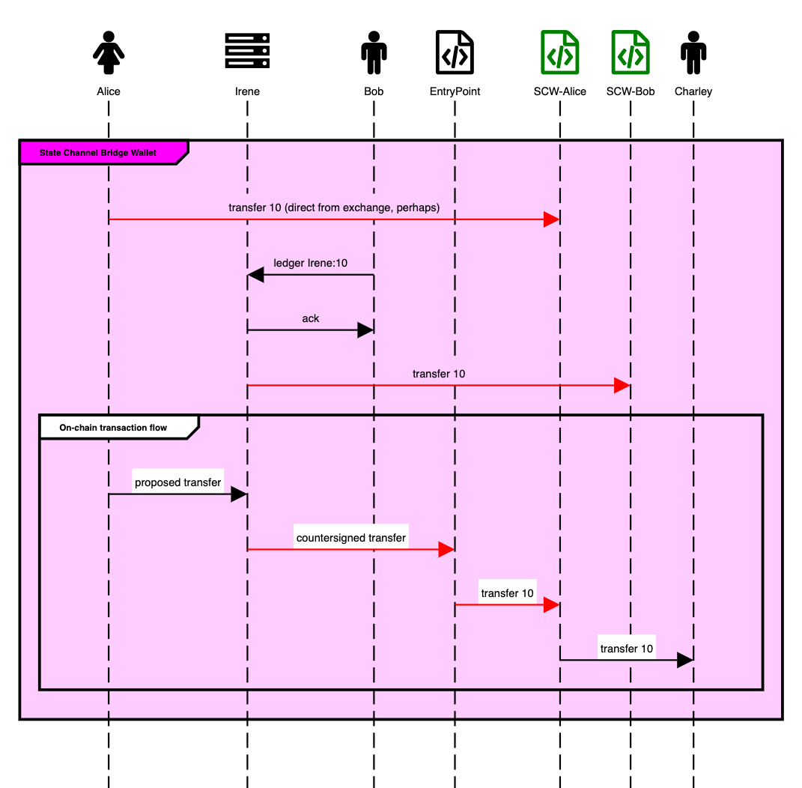
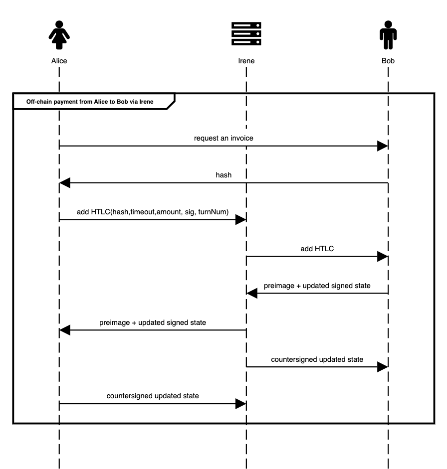

<h1 align="center">
<div><br>
SCBridge-Wallet
</h1>
<h3 align="center">
ERC-4337 compliant smart contract wallet that enables gasless, instant finality cross-chain payments
</h3>

# Quickstart

Run each of these commands from the repo root directory:

```
yarn
yarn chain:a
yarn chain:b
yarn deploy-and-start-local
```

These commands do the following:

1. starts two different `hardhat` blockchain networks (chain a and chain b)
2. deploys the necessary smart contracts:

- `EntryPoint` on both chains
- `SCBridge-Wallet` for Alice on chain a
- `SCBridge-Wallet` for Bob on chain b

3. serves the UI on `http://localhost:5173/`

Open three browser tabs (all accessing `http://localhost:5173/`) and select a different user (Alice, Irene, Bob) for each tab to allow the cross-user messaging to work.

### Ingredients

This repo contains Solidity source code for a state channel bridge smart contract. It uniquely offers the ability to use deposited funds not only to send offchain payments to other channel network participants with zero fees and instant finality, but also to send arbitrary transactions on the underlying L1 blockchain without having to withdraw them first in a separate transaction.

This functionality is achieved by inviting a channel network peer to be a co-signatory Intermediary on your smart contract wallet. L1 transactions are first send to that Intermediary, who countersigns them and submits them to the mempool. The Intermediary therefore plays a role similar to an ERC-4337 "bundler" (only simpler). The Intermediary has the right to veto any L1 transaction, although they can be ejected at any time (and then either replaced with another Intermediary, or not). This allows them to ensure they retain any off-chain payments promised to them by the wallet owner. If they are ejected, they get to take that money with them.

By having that Intermediary perform the same role in several users' smart contract wallets, the off-chain payments can be routed over arbitrary hops through a payment network (a la Bitcoin Lightning).

This repo also contains Typescript source code for off-chain clients that can be run by a user and by a Intermediary, to enable to orchestrate the functionality described above.

### Sequence Diagram

Scenario: Alice wants to (a) pay Bob offchain and (b) pay Charley, who does not have a state channel bridge. Irene is an Intermediary actor.

In a typical state channel bridge architecture she must deposit funds into the ID of a "ledger channel" in a Singleton adjudicator contract. Her counterparty in that ledger channel (Irene) must have deposited into another ledger channel with Bob. If Alice wants to send Charley money using those deposited funds, she needs to close the ledger channel, withdraw the funds (in one L1 tx), and submit the transfer to Charley (in another L1 tx).



<!-- diagram source, edit at sequencediagram.org
fontawesome f182 Alice
fontawesome f233 Irene
fontawesome f183 Bob

fontawesome f0e3 Adjudicator #red
fontawesome f183 Charley

group #lightgreen Typical State Channel Bridge

Alice->Irene: ledger 10/0
Alice<-Irene: ack
Alice-#red>Adjudicator: deposit 10
Bob->Irene: ledger 0/10
Bob<-Irene: ack
Irene-#red>Adjudicator: deposit 10
group On-chain transaction flow
Alice->Irene: close ledger
Alice<-Irene: ack
Alice-#red>Adjudicator: withdraw 10
Adjudicator--#red>Alice: withdraw 10
Alice-#red>Charley: transfer 10
end
end
-->

With the State Channel Bridge Wallet (SCBridge-Wallet) Architecture, she can instead send Irene the proposed transfer to Charley. Irene checks that this new payment doesn't compromise any HTLC payments, and then countersigns it and submits it to Alice's SCBridge-Wallet via en EntryPoint contract. The SCBridge-Wallet validates the countersigned transaction, then transfers some of the wallet funds to Charley.



<!-- diagram source, edit at sequencediagram.org
fontawesome f182 Alice
fontawesome f233 Irene
fontawesome f183 Bob

fontawesome f1c9 EntryPoint
fontawesome f1c9 SCW-Alice #green
fontawesome f1c9 SCW-Bob #green
fontawesome f183 Charley

group #ff00ff State Channel Bridge Wallet
Alice-#red>SCW-Alice: transfer 10 (direct from exchange, perhaps)
Bob->Irene: ledger Irene:10
Bob<-Irene: ack
Irene-#red>SCW-Bob: transfer 10
group On-chain transaction flow
Alice->Irene: proposed transfer
Irene-#red>EntryPoint: countersigned transfer
EntryPoint-#red>SCW-Alice: transfer 10
SCW-Alice->Charley: transfer 10
end
end
-->

In either case, executing a multihop payment from Alice to Bob is as easy as executing the well known HTLC (Hash Timelocked Contract) protocol, which is the same technology that powers the Bitcoin Lightning Network.



<!-- diagram source, edit at sequencediagram.org
fontawesome f182 Alice
fontawesome f233 Irene
fontawesome f183 Bob

group Off-chain payment from Alice to Bob via Irene
Alice->Bob: request an invoice
Bob->Alice: hash
Alice->Irene: add HTLC(hash,timeout,amount, sig, turnNum)
Irene->Bob: add HTLC
Bob->Irene: preimage + updated signed state
Irene->Alice: preimage + updated signed state
Irene->Bob: countersigned updated state
Alice->Irene: countersigned updated state
end
-->

### Future work

This repo originated as an entry for the ETHGlobal 2023 hackathon. Therefore the code takes some shortcuts to enable an end-to-end demo given the time constraints. The following list identifies future areas for improvement if this foundation was used to build a production-ready application.

1. `Messaging`: currently in-browser [BroadcastChannels](https://nodejs.org/api/worker_threads.html#class-broadcastchannel-extends-eventtarget) are used to communicate between the different users. A proper messaging service should allow users to exchange messages when they are on different machines with different IP addresses. Possible technologies include: WebSockets, WebRTC, HTTP requests, etc.
2. `Key management`: currently the private signing keys used by each user to sign blockchain txs and state channel messages are stored in a static [.env](./.env) file. These keys are read by the browser code and inserted in the the JavaScript running on the page. Since these keys control the movement of funds, they should be stored more securely, i.e. in Metamask or another crypto wallet.
3. `Intermediary funding`: a key requirement for this state channel system to work is that Intermediaries need to ear-mark some of their own funds for end users so that off-chain payments can occur by rebalancing the funds designated for each user. This requires Intermediaries to essentially "lock up" some of their own money. There should be incentives (e.g. payment processing fees) for the Intermediaries to provide this service. [Eigenlayer](https://docs.eigenlayer.xyz/overview/readme) re-staking could also be leveraged to unlock previously unused capital. Ethereum validator users who are already comfortable running reliable infrastructure are the type of actor who would likely be able to provide Intermediary services as well.
4. `Intermediary centralization`: the requirement of an Intermediary actor in this system is a centralizing force. A payment channel network is more performant if end users are connected to the same Intermediary. The ability of the end user to "Eject" and replace an Intermediary is a nice way to mitigate risk and multi-hop payments (i.e. traversing multiple Intermediaries) are possible, but more research should be done to determine if incentives can be designed to reduce the natural draw towards centralization.
5. `User onboarding`: currently there are hardcoded scripts to connect the Intermediary with users and ear-mark some of the Intermediary's funds for Alice and Bob. In a production environment there should be an easy way for end users to discover Intermediaries, and to negotiate how much of the Intermediary funds are ear-marked for their address.
6. `Eject Intermediary`: currently the implementation to "Eject" an Intermediary from a SCBridge-Wallet contract is stubbed out. This is an essential feature for the user to retain permissionless control of their funds.
